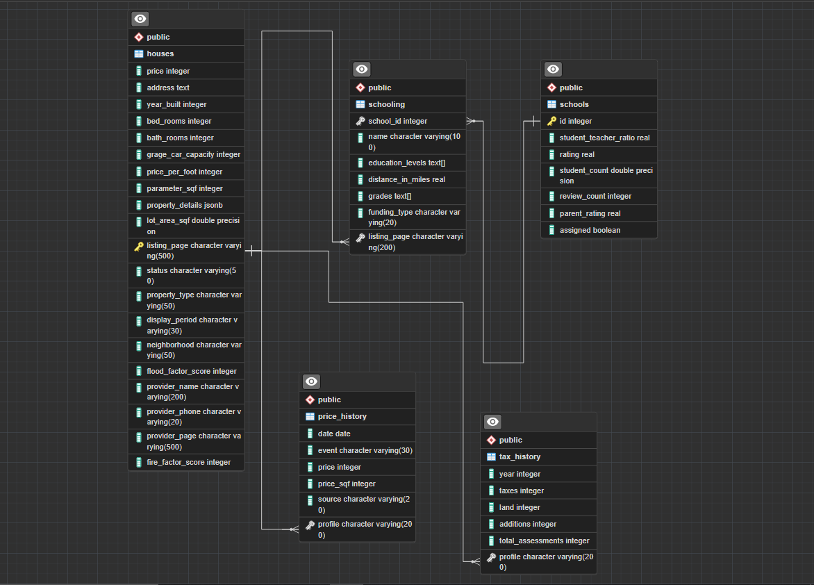

# **Realtor DataBase Built:**

- this project is a demonstration for building a database of scraped data from the internet which got can be scraped in formats like csv, xlsx, json, ect. using the SCRAPED AS JSON project which was uploaded on my GitHub profile.
- then the data within these files are cleansed using pandas library in python like in 'data cleansing.ipynb' file or using sql or through a combination of both according to the project and its requirements .
- the last step is to build the database using Postgresql through further data cleansing shown in 'realtor.sql' file to better suit the nature of sql queries and the database logic to make an effective and efficient database.

> the data base functionality is tested by a real world scenario in 'realtor test.sql' file.

> the ERD logic is demonstrated as in both the below photo & 'final ERD.pgerd' files.

    
